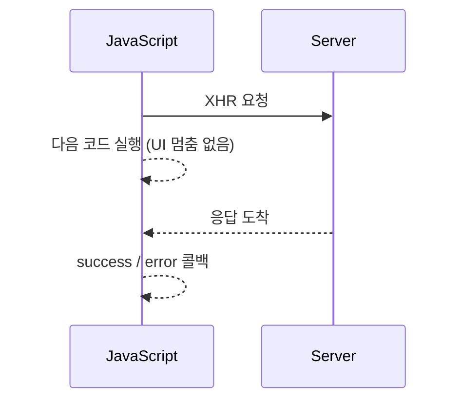
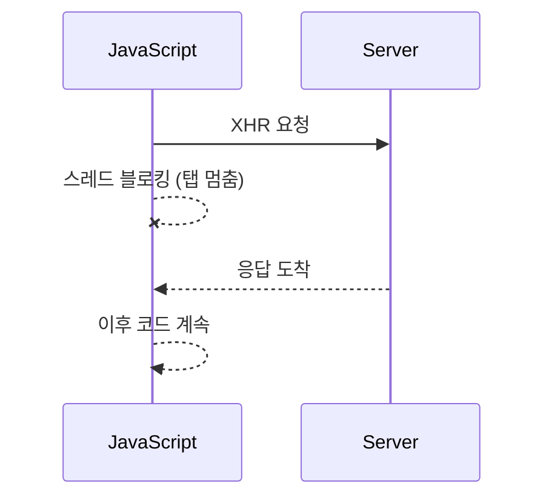

# jQuery `$.ajax()` `async` 옵션 정리

> **목적**  
> `async: true → false`(비동기 → 동기)로 변경하면서 나타난 현상과 Ajax 기본 개념

---

## 1. `async` 옵션이란?

| 값 | 기본값 | 의미 | 브라우저 동작 |
| --- | --- | --- | --- |
| `true` | **기본값** | **비동기** XHR | 요청을 백그라운드로 보내고 JavaScript 실행이 즉시 다음 라인으로 진행된다.<br>응답이 도착하면 **콜백**(`success`, `error`, `done` 등)이 호출된다. |
| `false` | – | **동기** XHR | 메인 스레드가 응답이 올 때까지 완전히 멈춘다. UI 렌더링·스크롤·클릭 등이 모두 블로킹된다. |

---

## 2. 동기 vs 비동기 흐름

### 2.1 비동기(`async:true`)



### 2.2 동기(`async:false`)



---

## 3. “동기로 바꿨더니 문제 해결”의 실제 이유

| 관찰 | 내부 메커니즘 |
| --- | --- |
| **비동기**일 때 Ajax `error` → 알림 후 곧 페이지 전체 오류 화면 | 복원 과정에서 **서버(Tomcat)가 재시작/다운** → Ajax 연결 실패 → 전역 `ajaxError` 핸들러·302 Redirect·열린 TCP 세션 끊김 등이 페이지 이동을 유발 |
| **동기**로 바꾸자 페이지가 잠깐 멈춘 뒤 정상 알림 | 동기 호출이라 브라우저가 **응답을 기다리는 동안** 서버 재시작이 완료 → 정상 200 응답 → `success` 콜백 실행 → 내부 `location.reload()`만 수행 |

즉 **타이밍 문제**를 동기가 “기다려 줌”으로써 가려 준 것이다.

---

## 4. `error` 콜백이 실행되는 대표 상황

| 범주 | 구체적 예 | `status` / `err` 값 |
| --- | --- | --- |
| 네트워크/연결 실패 | 서버 다운, 방화벽 차단 | `status:"error"`, `jqXHR.status == 0` |
| HTTP 오류 | 404, 500, 503 등 | `status:"error"`, `jqXHR.status == 500` |
| JSON 파싱 오류 | `Content-Type: application/json`인데 HTML 반환 | `status:"parsererror"` |
| 타임아웃 | `timeout:` 설정 초과 | `status:"timeout"` |
| CORS 실패 | 허용 헤더 누락 | `status:"error"`, `jqXHR.status == 0` |

`error` 콜백이 뜬다고 해서 **브라우저 세션이 자동 재생성**되지는 않는다.  
다음 요청에서 JSESSIONID 쿠키가 그대로 전송되고, 서버가 세션을 유지했는지 여부에 따라 새 세션이 만들어질 수도 있다.

---

## 5. 장단점 비교

| 항목 | 비동기(`true`) | 동기(`false`) |
| --- | --- | --- |
| **UX** | UI 멈춤 없음 | 요청 동안 탭 프리즈, “응답 없음” 경고 가능 |
| **표준/호환성** | 권장(안전) | Chrome 80+ 이후 콘솔 경고·일부 차단 |
| **코드 구조** | 콜백 / Promise / `async-await` | 절차적(순차) |
| **중복 요청** | 직접 버튼 `disabled` 필요 | 스레드 블로킹으로 자연 방지 |
| **추천도** | **권장** | 레거시·특수 상황 외 지양 |

---

## 6. Best Practice (비동기를 유지하면서 안정성 확보)

1. **UI 잠금 & 진행 표시**  
   - 버튼 `disabled`, 스피너 또는 다이얼로그로 “복원 중” 안내
2. **서버 재시작 시그널 처리**  
   - 서버는 복원 요청에 **HTTP 202 Accepted** 즉시 반환 → 클라이언트는 폴링/웹소켓으로 “완료” 이벤트 대기
3. **전역 Ajax 에러 핸들러 예시**

```javascript
$(document).ajaxError(function (e, xhr) {
    if (xhr.status === 401) location.href = '/login';
    else if (xhr.status === 0) alert('서버 연결이 끊겼습니다.');
});
```

---

## 7. 개선 예제 코드 (`fetch` + `async-await`)

```javascript
async function restoreDB(file) {
  if (!file) return;

  lockUI(true);                         // 버튼 disable & 스피너
  const dlg = $.Zebra_Dialog('복원 중…', { buttons: [] });

  try {
    const fd = new FormData();
    fd.append('file', file);

    const res = await fetch('/server/site/immediately_db_restore.json', {
      method: 'POST',
      body: fd
    });
    const data = await res.json();
    dlg.close();

    const msg = (data.resultCode === 200)
      ? '복원이 성공하였습니다.'
      : '복원이 실패하였습니다.';
    await new Promise(r =>
      $.Zebra_Dialog(msg, { buttons: ['확인'], onClose: r })
    );
    location.reload();                 // 필요 시 유지/삭제
  } catch (e) {
    dlg.close();
    $.Zebra_Dialog('서버와 통신할 수 없습니다.', { buttons: ['확인'] });
  } finally {
    lockUI(false);                     // UI 잠금 해제
  }
}
```

---

## 8. 결론

- `async:false`는 **근본 해결이 아닌, 타이밍 지연으로 문제를 가렸을 뿐**이다.  
- **비동기를 유지**하면서  
  1. UI 잠금·진행 표시  
  2. 서버 재시작 시그널 처리  
  3. 전역 에러 핸들러  
  를 구현하는 편이 **표준 준수, 사용자 경험, 유지보수** 측면에서 최선이다.
